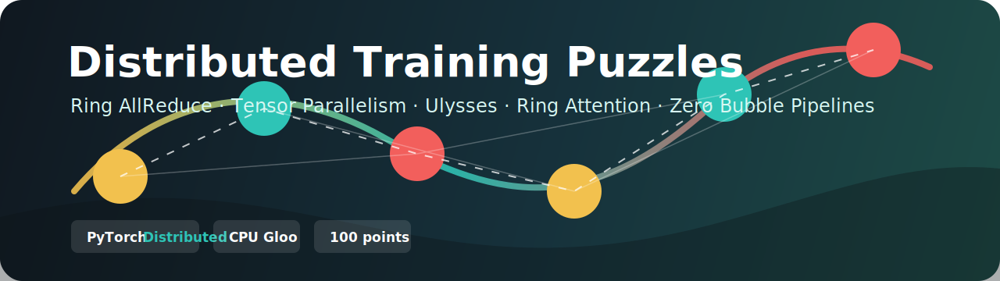

# Distributed Training Puzzles


Hands-on PyTorch Distributed puzzles for learning how modern large model training scales across devices. The assignment lives in [src/Distributed_Training_Puzzles.ipynb](src/Distributed_Training_Puzzles.ipynb) and is designed to run on a CPU-only Google Colab runtime with the Gloo backend.

[](https://colab.research.google.com/github/khab40/dist-train-puzzles/blob/master/src/Distributed_Training_Puzzles.ipynb)

## Assignment

The notebook asks you to implement distributed training building blocks and verify them with built-in tests:

| Puzzle | Points | Topic | What you build |
| --- | ---: | --- | --- |
| A | 20 | Ring AllReduce | A bandwidth-balanced AllReduce implementation using point-to-point communication. |
| B | 20 | Tensor Parallelism | Column-parallel and row-parallel linear layers plus a tensor-parallel Transformer MLP. |
| C | 20 | Ulysses | Differentiable all-to-all sequence/head reshaping and sequence-parallel self-attention. |
| D | 30 | Ring Attention | KV rotation primitives and distributed exact attention over sharded context. |
| E | 10 | Zero Bubble Pipelining | A ZB-H2-style pipeline schedule for forward, backward-input, and backward-weight work. |

The exercises focus on:

- PyTorch Distributed process groups, device meshes, and `torchrun`.
- Collective operations implemented from first principles.
- Model, sequence, context, attention, and pipeline parallelism patterns.
- CPU-compatible distributed tests that make the algorithms easy to inspect.

## Repository Layout

```text
.
├── README.md
├── CHANGELOG.md
├── docs/
│   ├── assignment.md
│   └── banner.svg
└── src/
    └── Distributed_Training_Puzzles.ipynb
```

## Run

Use the Colab badge above for the intended workflow, or open the notebook locally in Jupyter. The notebook cells include the required imports and tests.

For local execution, install PyTorch and Jupyter in your preferred environment, then open:

```bash
jupyter notebook src/Distributed_Training_Puzzles.ipynb
```

Some cells write helper scripts and run multi-process checks, for example:

```bash
OMP_NUM_THREADS=1 torchrun --standalone --nnodes=1 --nproc-per-node=4 ring_allreduce.py
```

Generated helper scripts are ignored by Git so the repository stays focused on the assignment notebook and documentation.

## Notes

- The notebook uses the Gloo backend so the puzzles can run without GPUs.
- Reference outputs and tests are embedded next to the implementation cells.
- The current branch is mapped to `https://github.com/khab40/dist-train-puzzles.git`.
