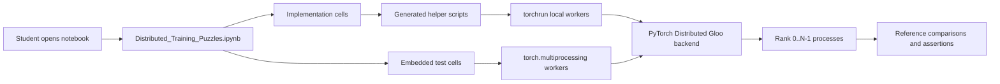
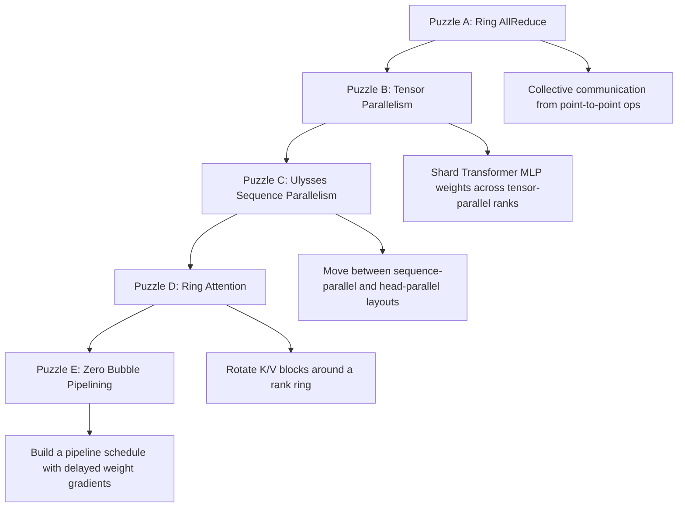
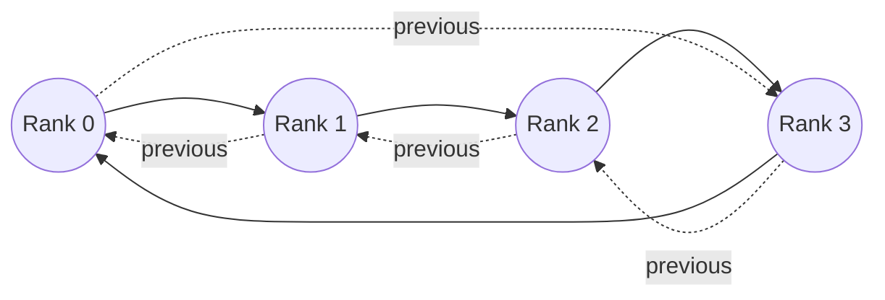
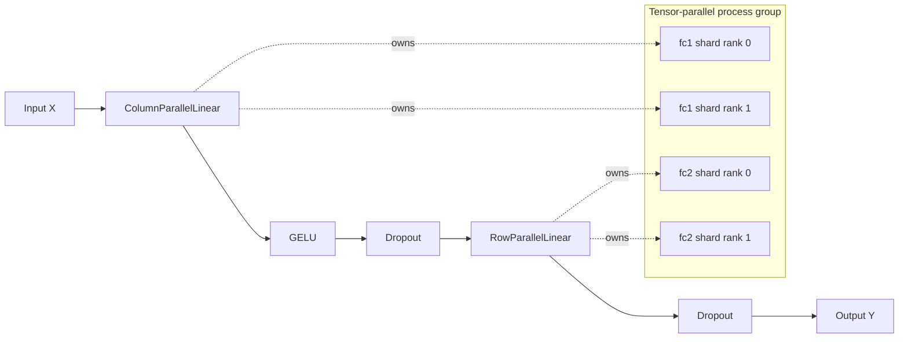
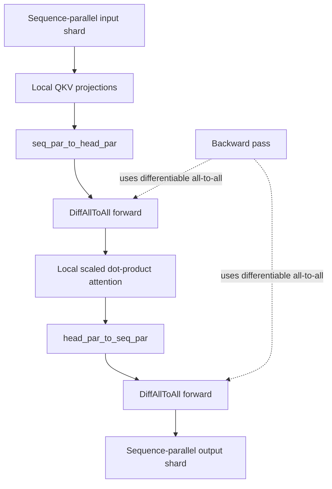
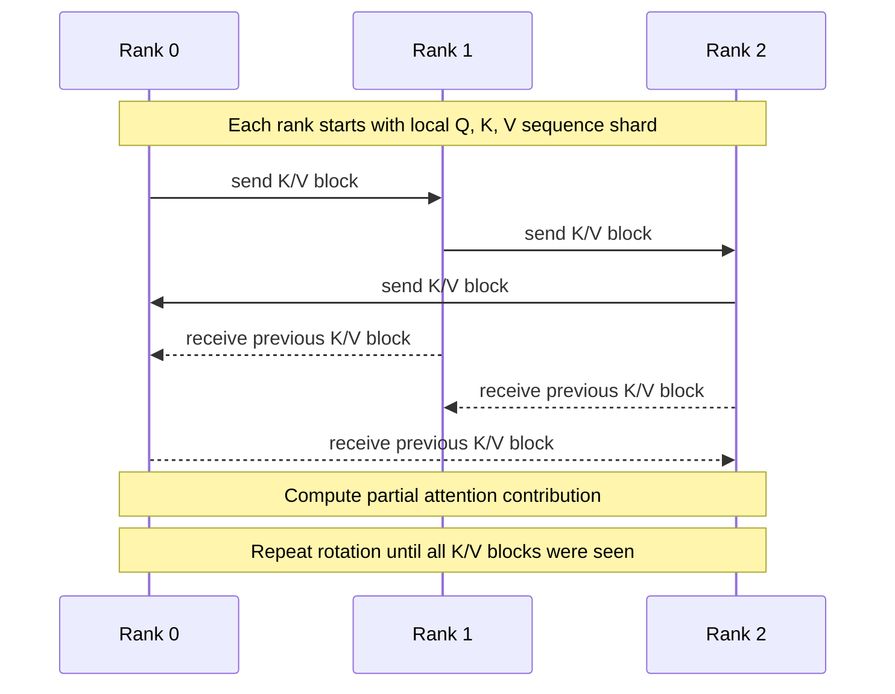
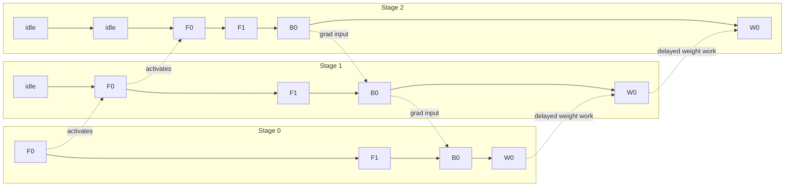
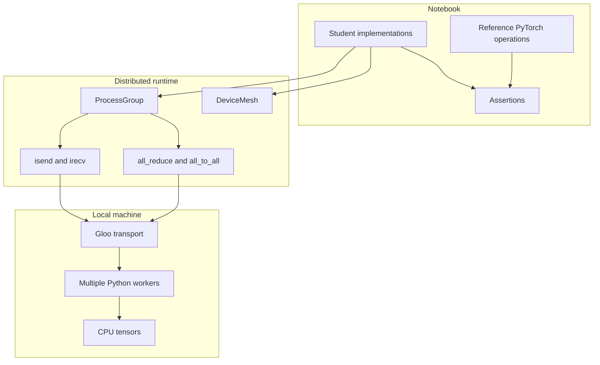

# Architecture

This repository contains one notebook-based assignment:

- `src/Distributed_Training_Puzzles.ipynb`

The notebook is not an application with a long-running service. It is a set of PyTorch Distributed exercises that write small helper scripts, launch local multi-process workers with `torchrun` or `torch.multiprocessing`, and validate each implementation against embedded tests.

## Runtime Model

The code should run on CPU-only machines by using the PyTorch Distributed Gloo backend. Each puzzle creates a process group, assigns each process a rank, shards tensors or work across ranks, performs communication, and checks the result against a known-correct reference.

## Puzzle Map

## Puzzle A: Ring AllReduce

`ring_allreduce(x, pg)` should replace a naive rank-0 gather/sum/broadcast with a ring algorithm. Every rank communicates with only its neighbors, balances communication volume across ranks, and ends with the same reduced tensor.

Expected behavior:

- Split the local tensor into rank-sized chunks.
- Run reduce-scatter around the ring so each rank owns one reduced chunk.
- Run all-gather around the ring so every rank reconstructs the full reduced tensor.
- Match `dist.all_reduce` for tested tensor shapes, dtypes, rank order, and process-group subsets.

## Puzzle B: Tensor Parallel Transformer MLP

The tensor-parallel MLP should behave like a normal Transformer MLP while sharding large weight matrices across ranks.

Expected behavior:

- `ColumnParallelLinear` stores output-feature shards of the first projection.
- `RowParallelLinear` stores input-feature shards of the second projection.
- `ParallelTransformerMLP` composes both layers with activation and dropout.
- Distributed output and gradients match the equivalent non-parallel `TransformerMLP`.

## Puzzle C: Ulysses Self-Attention

Ulysses should shard long sequences across ranks, use all-to-all communication to redistribute data by attention heads, run local attention, and convert the output back to sequence-parallel layout.

Expected behavior:

- `DiffAllToAll.forward` performs all-to-all redistribution.
- `DiffAllToAll.backward` applies the inverse redistribution for gradients.
- `seq_par_to_head_par` changes layout from sequence-sharded to head-sharded.
- `head_par_to_seq_par` restores sequence-sharded output.
- Local attention over redistributed heads matches full reference attention after reassembly.

## Puzzle D: Ring Attention

Ring Attention should compute exact unmasked self-attention for sequence-sharded context without materializing the full K/V context on every rank at once.

Expected behavior:

- `start_kv_rotate` schedules asynchronous neighbor sends and receives with `dist.batch_isend_irecv`.
- `wait_all` waits for every communication request.
- `ring_attention` rotates K/V shards around the rank ring.
- Each rank keeps its local Q shard and updates attention output using numerically stable online softmax logic.
- Final output matches `torch.nn.functional.scaled_dot_product_attention` against full K/V context.

## Puzzle E: Zero Bubble Pipeline Schedule

`zb_h2_schedule(n, m)` should return a schedule table for `n` pipeline stages and `m` microbatches. It models forward work, backward-input work, and backward-weight work as equal-duration slots while delaying weight-gradient work off the critical path.

Expected behavior:

- Stage `i` starts with `i` idle slots.
- Every stage schedules `m` forward tokens, `m` backward-input tokens, and `m` backward-weight tokens.
- Backward-input work stays on the critical path.
- Backward-weight work is delayed where possible to reduce pipeline bubbles.
- The generated rows satisfy the notebook's structural and dependency tests.

## Data And Control Boundaries

The architecture intentionally keeps all code inside the notebook. Generated files are temporary execution artifacts, and the source of truth remains `src/Distributed_Training_Puzzles.ipynb`.
